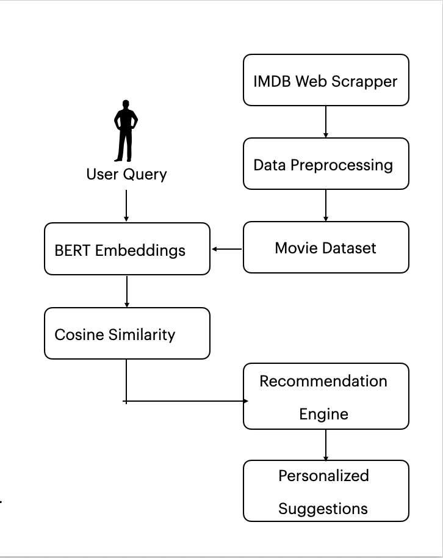
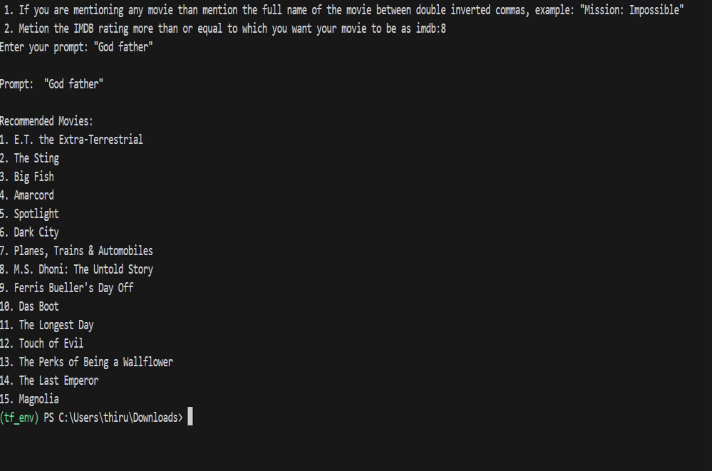

# 🎥 Transformers-Powered Movie Recommendation System (IMDb Scraping)

## 📖 Overview
This project is a **BERT-powered movie recommendation engine** that processes natural language user queries to suggest personalized movie recommendations. Users can input preferences such as specific movie titles or minimum IMDb ratings, and the system generates recommendations by analyzing **semantic similarity** between user queries and movie metadata.  

Recommendations are refined using **IMDb ratings** and previously mentioned movie preferences, ensuring high-quality, tailored results.  

---

## ✨ Features
1. **User Input Parsing**  
   - Recognizes movie names wrapped in double quotes (e.g., `"Inception"`).  
   - Supports IMDb rating filters via `imdb:<rating>` (e.g., `imdb:8.2`).  

2. **BERT Embeddings**  
   - Leverages **Hugging Face’s `bert-base-uncased`** model for semantic embeddings of movie overviews and user input.  

3. **Similarity Calculation**  
   - Computes **cosine similarity** between input and dataset embeddings.  
   - Uses weighted similarity when specific movies are included in the query.  

4. **Customizable Recommendations**  
   - Apply IMDb rating filters.  
   - Include specific movies to fine-tune results.  

5. **Top-N Suggestions**  
   - Returns the **top 15 most relevant movies** ranked by similarity score.  

---

## ⚙️ Requirements
- Python 3.7+  
- Dependencies:  
  - `pandas`  
  - `numpy`  
  - `torch`  
  - `transformers`  
  - `scikit-learn`  
  - `re`  

---

## 📊 Dataset
The system uses the file **`imdb_top_1000.csv`**, which must contain the following columns:  
- `Genre`  
- `Series_Title`  
- `IMDB_Rating`  
- `Overview`  

---

## 🔧 Installation
1. Clone this repository or download it:  
   ```bash
   git clone https://github.com/lilswapnil/Movie-Recommendation-System-using-Transformers-and-IMDb-web-scraping.git
   cd transformers-powered-Movies-recommendation-system-using-IMDB-web-scraping
Install dependencies:

bash
Copy code
pip install pandas numpy torch transformers scikit-learn
Download the dataset imdb_top_1000.csv and place it in the working directory.
Update the file_path variable in the script to point to the dataset location.

▶️ Usage
Run the script:

bash
Copy code
python trans2.py
Follow the prompts:

Enter movie names in double quotes (e.g., "Inception").

Specify minimum IMDb ratings (e.g., imdb:8).

The system will return the top 15 recommended movies.

# 🎥 Transformers-Powered Movie Recommendation System (IMDb Scraping)

<p align="center">
  
  <br/>
  <em>High-level flow of the BERT-powered recommendation pipeline.</em>
</p>

## 📖 Overview
This project is a BERT-powered movie recommendation engine...

---

## 🖥 Example Results

<p align="center">
  
  <br/>
  <em>Sample recommendations returned by the system for query inputs.</em>
</p>


🛠 Code Walkthrough
1. Data Loading & Preprocessing
Loads dataset via pandas.

Filters relevant columns (Genre, Series_Title, IMDB_Rating, Overview).

2. BERT Model Integration
Loads BERT tokenizer & model (bert-base-uncased).

Converts movie overviews into embeddings.

3. User Input Processing
Normalizes text and extracts movie names / IMDb rating constraints.

4. Similarity Calculation
Computes cosine similarity between input embeddings and movie embeddings.

Adjusts weighting if specific movies are mentioned.

5. Recommendation
Returns top 15 matches ranked by similarity scores.

🖥 Example
Input:

arduino
Copy code
"Inception" imdb:8
Output:

markdown
Copy code
Recommended Movies:
1. The Dark Knight
2. Interstellar
3. Fight Club
4. Memento
5. The Prestige
...
⚡ Customization
IMDb Filter → Adjust extract_imdb_rating() for custom thresholds.

Number of Results → Change output size in recommend_movies() function.

🚧 Limitations
Limited to imdb_top_1000.csv dataset quality.

Embedding generation with BERT is computationally expensive for large datasets.

🔮 Future Enhancements
Include genre and cast-based filtering.

Fine-tune BERT embeddings on movie-specific datasets.

Add complex query support (e.g., “sci-fi thrillers with rating > 8”).

Optimize performance for larger movie datasets.

🙏 Acknowledgments
Dataset sourced from IMDb.

BERT model provided by the Hugging Face Transformers library.
